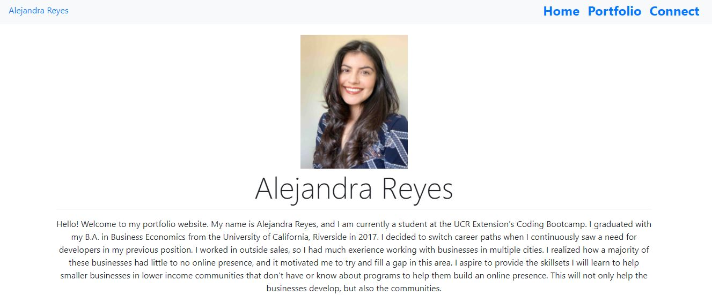

# Responsive Portfolio

### Deployed Application 

[Responsive Portfolio](https://areye022.github.io/responsiveportfolio/)

### Description 
This application is a responsive portfolio for Alejandra Reyes.

When you open the portfolio, the main page gives a brief description of Alejandra's academic and work history, along with another section describing her personality. There is a contact page and a project page that contains multiple projects she has worked on individually and as a team. 

### Features
* Responsive for all screentypes
* Utilizes Bootstrap features such as jumbotron, containers, etc.   
* Utilized unsplash for project image holders.
* Provides links to LinkedIn, Github, and stackoverflow

